# Building a Real-Time Risk Assessment App with Next.js & Yjs

> A comprehensive guide documenting the journey of building a production-ready real-time collaborative application. It covers architectural choices, implementation steps, state management patterns, and critically, the specific challenges we faced and overcame.

---

## Table of Contents

1. [Architecture Overview](#1-architecture-overview)
2. [Implementation Steps](#2-implementation-steps)
3. [State Management Deep Dive](#3-state-management-deep-dive)
4. [Data Flow & Synchronization](#4-data-flow--synchronization)
5. [Persistence Architecture](#5-persistence-architecture)
6. [Sidecar Architecture Patterns](#6-sidecar-architecture-patterns)
7. [Challenges & Solutions](#7-challenges--solutions-the-gotchas)
8. [Final Recommendations](#8-final-recommendations-for-students)
9. [Offline Editing](#9-offline-editing)
10. [Authentication & Authorization with Auth.js & Entra ID](#10-authentication--authorization-with-authjs--entra-id)

---

## 1. Architecture Overview

To achieve real-time collaboration with persistence, we chose a **Hybrid Architecture**:

| Component | Technology | Purpose |
|-----------|------------|---------|
| **Framework** | Next.js 16 (App Router) | Frontend UI and API routes |
| **Real-Time Engine** | Yjs (CRDT library) | Conflict-free data merging |
| **Transport** | WebSockets | Instant updates between clients |
| **Persistence** | SQLite (via Prisma) | Durable document state |
| **Server** | Custom Node.js Server (TypeScript) | Unified hosting for Next.js + WebSockets |

### Why This Stack?

Standard Next.js Server Actions are great for request/response flows, but real-time collaboration requires **long-lived connections** (WebSockets). By using a custom server, we can attach a WebSocket server to the same HTTP server that Next.js uses, simplifying deployment to a single service.

### Architecture Diagram


---

## 2. Implementation Steps

### Step 1: Project Setup & Custom Server

We started by installing the core dependencies.

```bash
npm install yjs y-websocket @y/websocket-server ws prisma @prisma/client synced-store
```

The critical piece was `server.ts`. This file replaces the standard `next start` command. It initializes Next.js but also listens for WebSocket upgrades.

**Key Code: Custom Server (server.ts)**

```typescript
// server.ts
import { createServer } from "http";
import next from "next";
import { WebSocketServer } from "ws";
import { setupWSConnection, setPersistence } from "@y/websocket-server/utils";
import * as persistence from "./persistence";

const app = next({ dev: process.env.NODE_ENV !== "production" });
const handle = app.getRequestHandler();

app.prepare().then(() => {
    const server = createServer((req, res) => {
    // Handle Next.js requests
        handle(req, res);
    });

  // Attach WebSocket Server
    const wss = new WebSocketServer({ noServer: true });

    // Set up global persistence BEFORE connections
    setPersistence({
        bindState: async (docName, doc) => {
            await persistence.loadDocFromDb(docName, doc);
            persistence.startCompactionTimer(docName, doc);
        },
        writeState: async (docName, doc) => {
            await persistence.saveAndCompact(docName, doc);
            persistence.stopCompactionTimer(docName);
        }
    });

    server.on("upgrade", (req, socket, head) => {
        if (req.url?.startsWith("/yjs/")) {
            wss.handleUpgrade(req, socket, head, (ws) => {
                wss.emit("connection", ws, req);
            });
        }
    });

  // Wiring up Yjs
  wss.on('connection', (ws, req) => {
    setupWSConnection(ws, req, { gc: true });
    });

    server.listen(3000);
});
```

---

### Step 2: Database Layer (SQLite via Prisma)

Instead of manual SQL queries, we chose **Prisma** with SQLite. This provides type-safe access and a clear schema for our "Snapshot + Updates" persistence strategy. We enable **WAL (Write-Ahead Logging)** mode in SQLite for better concurrency.

**The Workflow:**
1. **Snapshots**: Store the full state of a Y.Doc periodically (Compaction).
2. **Updates**: Store individual incremental updates between snapshots (Journaling).
3. **Load**: On server start, apply the latest snapshot and then all subsequent updates.

**Key Code: Persistence Logic**

```typescript
// persistence.ts (simplified)
export async function loadDocFromDb(docId: string, doc: Y.Doc) {
    // 1. Load latest full snapshot
    const snapshot = await prisma.documentSnapshot.findUnique({ where: { docId } });
    if (snapshot) Y.applyUpdate(doc, snapshot.data);

    // 2. Apply all incremental updates since that snapshot
    const updates = await prisma.documentUpdate.findMany({ where: { docId } });
    updates.forEach(u => Y.applyUpdate(doc, u.data));
}

export function scheduleFlush(docId: string, update: Uint8Array) {
    // Debounce and batch writes to prevent DB bottleneck
    // (See Section 5 for full implementation)
}
```

---

### Step 3: The Frontend Editor

We built a custom form editor combining **SyncedStore** for reactive UI state and **ProseMirror** for collaborative rich text:

- **SyncedStore** manages the CIA dropdowns and security controls using a reactive proxy.
- **ProseMirror** handles the Assessment Notes via the `y-prosemirror` binding.

#### Why SyncedStore?

While raw Yjs `Y.Map` and `Y.Text` are powerful, they require manual observation to keep React state in sync. **SyncedStore** provides a reactive proxy API: Any change to the store automatically triggers a React re-render, and any remote change from a peer is instantly reflected in the UI.

```typescript
// lib/store.ts
import { syncedStore } from "@syncedstore/core";

export const createStore = () => syncedStore({
    cia: {},            // Becomes a Y.Map
    controls: {},       // Becomes a Y.Map
    prosemirror: "xml", // Becomes a Y.XmlFragment
});
```

#### Integrating ProseMirror with SyncedStore

ProseMirror needs character-level change events, which standard textareas don't provide. We use `y-prosemirror` to bind a ProseMirror editor to the `Y.XmlFragment` stored inside our SyncedStore:

```typescript
// RiskAssessmentEditor.tsx
const docStore = useMemo(() => createStore(), []);
const state = useSyncedStore(docStore);

useEffect(() => {
    // 1. Get raw Y.Doc from SyncedStore
    const ydoc = getYjsDoc(docStore);
    const yXmlFragment = ydoc.getXmlFragment('prosemirror');

    // 2. Bind ProseMirror to it
    const editorState = EditorState.create({
        schema,
        plugins: [
            ySyncPlugin(yXmlFragment),
            yCursorPlugin(awareness),
            yUndoPlugin(),
            ...exampleSetup({ schema })
        ]
    });
    new EditorView(editorRef.current, { state: editorState });
}, []);
```

#### Benefits of This Combined Approach

| Feature | Plain Textarea | ProseMirror |
|---------|----------------|-------------|
| **Merge concurrent edits** | ❌ Last Write Wins | ✅ Character-level CRDT |
| **Remote cursors** | ❌ Not possible | ✅ See where others are typing |
| **Collaborative undo** | ❌ Global undo | ✅ Undo only your changes |
| **Offline editing** | ✅ Works | ✅ Works (same IndexedDB) |
| **Bundle size** | ~0 KB | ~80 KB |

The ~80KB cost is worth it for **true collaborative editing** where two users can type in the same paragraph simultaneously without conflicts.

**Key Code: CIA Dropdowns (Y.Map)**

```typescript
// Simple assignment triggers Yjs sync AND React re-render
const handleCiaChange = (field, value) => {
  state.cia[field] = value; 
};

// UI uses the reactive state directly
<select value={state.cia.confidentiality || 'Low'} ... />
```

---

## 3. State Management Deep Dive

One of the most important aspects of building a real-time app is understanding how state flows through the system. Our application uses a **multi-layered state architecture**.

### The Three Layers of State

```
┌─────────────────────────────────────────────────────────────────┐
│                    BROWSER (React Component)                     │
│  ┌─────────────────────────────────────────────────────────┐   │
│  │   SyncedStore Proxy (Reactive State)                      │   │
│  │   • state.cia, state.controls, state.prosemirror          │   │
│  │   • Triggers automatic React re-renders                   │   │
│  └───────────────────────┬─────────────────────────────────┘   │
│                          │                                       │
│  ┌───────────────────────▼─────────────────────────────────┐   │
│  │   Yjs Document (Y.Doc)                                    │   │
│  │   • Managed by SyncedStore                                │   │
│  │   • Source of truth for CRDT operations                   │   │
│  │   • Handles binary update encoding                        │   │
│  └───────────────────────┬─────────────────────────────────┘   │
└──────────────────────────┼──────────────────────────────────────┘
                           │ WebSocket (real-time sync)
┌──────────────────────────▼──────────────────────────────────────┐
│                    SERVER (Node.js + @y/websocket-server)       │
│  ┌─────────────────────────────────────────────────────────┐   │
│  │   In-Memory Y.Doc instances (per document room)          │   │
│  │   • Merges updates from all connected clients            │   │
│  │   • Broadcasts changes to all subscribers                │   │
│  └───────────────────────┬─────────────────────────────────┘   │
│                          │                                       │
│  ┌───────────────────────▼─────────────────────────────────┐   │
│  │   SQLite via Prisma                                       │   │
│  │   • documentSnapshots & documentUpdates tables            │   │
│  │   • Durable persistence with binary BLOBs                 │   │
│  │   • Efficient journaled writes                            │   │
│  └─────────────────────────────────────────────────────────┘   │
└─────────────────────────────────────────────────────────────────┘
```

### React + SyncedStore vs. Raw Yjs

Using **SyncedStore** removes the need for manual `useState` and `observe()` pairings.

| Aspect | Manual Management | SyncedStore Approach |
|--------|-------------------|----------------------|
| **Local Update** | `ciaMap.set(k, v)` | `state.cia.k = v` |
| **UI Updates** | `ciaMap.observe(...)` | Automatic (Reactive Proxy) |
| **Consistency** | Manual React state sync | Reflects Yjs state directly |
| **Complexity** | High boilerplate | Low boilerplate |

```typescript
// Pattern: Automatic Reactive Sync
// Changing a property on the proxy...
state.cia.confidentiality = "High";

// ...instantly updates the underlying Y.Doc AND 
// triggers re-renders in all components using this state.
```

This would be the pattern if we did not use syncedstore: 
```typescript
// Pattern: Yjs → React (receiving remote changes)
ciaMap.observe(() => {
  setCia({
    confidentiality: ciaMap.get('confidentiality') || 'Low',
    integrity: ciaMap.get('integrity') || 'Low',
    availability: ciaMap.get('availability') || 'Low',
  });
});

// Pattern: React → Yjs (sending local changes)
const handleCiaChange = (field: string, value: string) => {
  const ciaMap = ydoc.getMap('cia');
  ciaMap.set(field, value);  // This triggers the observer above
};
```

### User Presence with Awareness

Yjs provides an **Awareness** protocol for tracking who's connected (ephemeral state):

```typescript
const awareness = provider.awareness;

// Set local user's info
awareness.setLocalStateField('user', { name: userName, color: '#f87171' });

// Listen for changes in who's online
awareness.on('change', () => {
    const states = Array.from(awareness.getStates().values());
    const activeUsers = states.map(s => s.user?.name).filter(Boolean);
    setUsers(activeUsers);
});
```

---

## 4. Data Flow & Synchronization

### How an Edit Propagates

When User A changes the "Confidentiality" dropdown from "Low" to "High":


### The CRDT Magic

Yjs uses **CRDTs (Conflict-free Replicated Data Types)** to handle concurrent edits:

- **`Y.Map`**: Last-write-wins per key. If two users change `confidentiality` at the same moment, both get the same final value (deterministically).
- **`Y.Text`**: Character-level merging. If two users type in different positions, both changes are preserved.

---

## 5. Persistence Architecture

Our persistence strategy goes beyond simple "save on every keystroke." We implemented a **three-tier system** for durability and efficiency:

```mermaid
flowchart TD
    %% Nodes
    Update["⚡ Incoming Yjs Update"]
    Buffer["📦 In-Memory Buffer<br/>(pendingUpdates)"]
    Debounce{"⏳ 50ms<br/>Inactivity?"}
    Flush["🌊 Flush to DB"]
    DB_Log[("📝 document_updates<br/>(Incremental Log)")]
    CompactionTimer{"⏱️ Every 10s"}
    Compact["🔨 Compact Document"]
    DB_Snap[("📸 document_snapshots<br/>(Full State)")]
    Sidecar[("🏷️ Document Metadata<br/>(CIA / Queryable Cols)")]

    %% Styles
    classDef event fill:#ffe0b2,stroke:#ef6c00,stroke-width:2px;
    classDef logic fill:#e1f5fe,stroke:#0277bd,stroke-width:2px;
    classDef db fill:#e8f5e9,stroke:#2e7d32,stroke-width:2px;

    class Update,CompactionTimer event;
    class Buffer,Debounce,Flush,Compact logic;
    class DB_Log,DB_Snap,Sidecar db;

    %% Flow
    Update --> Buffer
    Buffer --> Debounce
    Debounce -- No --> Buffer
    Debounce -- Yes --> Flush
    Flush -- MERGE & INSERT --> DB_Log

    CompactionTimer --> Compact
    Compact -- "1. Read Full State" --> Buffer
    Compact -- "2. UPSERT Snapshot" --> DB_Snap
    Compact -- "3. DELETE Old Logs" --> DB_Log
    Compact -- "4. SYNC Columns" --> Sidecar
```



### Why This Approach?

| Strategy | Pros | Cons |
|----------|------|------|
| Save every keystroke | Simple, zero data loss | High DB load, slow |
| Save on disconnect only | Minimal DB load | Data loss if server crashes |
| **Debounce + Compaction** | Balanced load, minimal loss | More complex |

### Implementation: Debounced Flushing

> **Flushing** refers to the process of taking the **server's** temporary buffer of in-memory changes and writing them to the permanent database.

Updates are batched into a `pendingUpdates` array and flushed after 50ms of inactivity:

```typescript
// persistence.ts
export function scheduleFlush(docId: string, doc: Y.Doc) {
    const meta = getOrCreateMeta(docId, doc);
    
    if (meta.flushTimer) clearTimeout(meta.flushTimer);
    meta.flushTimer = setTimeout(() => {
        meta.flushTimer = null;
        void flushPendingUpdates(docId, doc);
    }, 50);  // 50ms debounce
}

async function flushPendingUpdates(docId: string, doc?: Y.Doc) {
    const meta = documentMetadataMap.get(docId);
    if (!meta || meta.pendingUpdates.length === 0) return;

    const merged = Y.mergeUpdates(meta.pendingUpdates);
    
    try {
        await prisma.documentUpdate.create({
            data: {
                documentId: docId,
                update: Buffer.from(merged),
                createdAt: BigInt(Date.now()),
            },
        });
        // Clear pending ONLY after successful DB write
        meta.pendingUpdates = [];
        meta.updatesSinceLastCompaction += 1;
        
        // Parallel: Sync CIA values to the Document table
        if (doc) await syncDocumentCIAValues(docId, doc);
    } catch (error) {
        console.error(`[Flush] Failed for ${docId}:`, error);
    }
}
```

### Implementation: Periodic Compaction

Every 10 seconds, we compact all pending updates into a single snapshot to prevent the update journal from growing indefinitely:

```typescript
export function startCompactionTimer(docId: string, doc: Y.Doc) {
    const meta = getOrCreateMeta(docId, doc);
    if (meta.compactionTimer) return;

    meta.compactionTimer = setInterval(() => {
        void compactDocument(docId, doc);
    }, 10_000);
}

async function compactDocument(docId: string, doc: Y.Doc) {
    await flushPendingUpdates(docId, doc); // Ensure last updates are flushed
    
    const snapshot = Y.encodeStateAsUpdate(doc);
    
    await prisma.$transaction([
        // 1. Save full state to snapshot table
        prisma.documentSnapshot.upsert({
            where: { documentId: docId },
            update: { snapshot: Buffer.from(snapshot), updatedAt: BigInt(Date.now()) },
            create: { documentId: docId, snapshot: Buffer.from(snapshot), updatedAt: BigInt(Date.now()) },
        }),
        // 2. Clear the incremental update journal
        prisma.documentUpdate.deleteMany({ where: { documentId: docId } }),
    ]);
}
```

### Cleanup on Disconnect

To prevent memory leaks, we stop timers when all clients disconnect:

```typescript
// server.ts
setPersistence({
    bindState: async (docName, doc) => {
        await persistence.loadDocFromDb(docName, doc);
        persistence.startCompactionTimer(docName, doc);
    },
    writeState: async (docName, _doc) => {
        // Called when last client disconnects
        persistence.stopCompactionTimer(docName);
    },
});
```

### Database Schema (Prisma)

```prisma
model Document {
    id              String   @id
    title           String
    confidentiality Int      @default(0)
    integrity       Int      @default(0)
    availability    Int      @default(0)
    
    snapshot DocumentSnapshot?
    updates  DocumentUpdate[]
}

model DocumentSnapshot {
    documentId String   @id
    document   Document @relation(fields: [documentId], references: [id], onDelete: Cascade)
    snapshot   Bytes
    updatedAt  BigInt
}

model DocumentUpdate {
    id         Int      @id @default(autoincrement())
    documentId String
    document   Document @relation(fields: [documentId], references: [id], onDelete: Cascade)
    update     Bytes
    createdAt  BigInt
    
    @@index([documentId, id])
}
```

> **Note**: The `onDelete: Cascade` ensures that when a Document is deleted, its snapshots and updates are automatically cleaned up.

### Document Closing Workflow

When closing a document (e.g., navigating away), the system ensures data consistency through a coordinated process. The [`SaveAndRedirectLink`](components/SaveAndRedirectLink.tsx:16) component triggers an explicit save via the [`POST /api/documents/[documentId]/save`](app/api/documents/[documentId]/save/route.ts:15) endpoint before navigation. This ensures CIA values and pending Yjs updates are flushed to the database. On the server side, when all clients disconnect, [`saveAndCompact()`](persistence.ts:267) is called automatically, which flushes pending updates and creates a final snapshot to guarantee durability.

### Strategy: Syncing Queryable Fields (Sidecar Sync)

As your application grows (e.g., adding "Likelihood", "Impact", or "Overview" views), you might be tempted to set up individual listeners for every field to keep your SQL database in sync for queries:

```typescript
// ❌ Don't do this: Maintenance nightmare & Race conditions
yDoc.getMap('cia').observe(() => syncCIA());
yDoc.getMap('likelihood').observe(() => syncLikelihood());
yDoc.getMap('impact').observe(() => syncImpact());
```

**The Better Way: Sync on Compaction**

Instead, hook into the **compaction/persistence flow**. Since we are already debouncing writes and periodically compacting the full state, this is the perfect moment to extract all queryable fields and update your relational columns in one atomic operation.

```typescript
// persistence.ts (Conceptual)
async function compactDocument(docId: string, doc: Y.Doc) {
    // 1. Get raw values from Yjs
    const cia = doc.getMap('cia').toJSON();
    const likelihood = doc.getMap('likelihood').toJSON();

    // 2. Sync to SQL columns ATOMICALLY with the snapshot
    await prisma.$transaction([
        prisma.documentSnapshot.upsert({ ... }),
        prisma.document.update({
             where: { id: docId },
             data: {
                 confidentiality: cia.confidentiality,
                 likelihoodScore: likelihood.score,
                 // ... other queryable fields
             }
        })
    ]);
}
```

**Why this wins:**
1.  **Natural Debouncing**: You piggyback on the existing batching logic (saving DB load).
2.  **Atomic Consistency**: Your SQL columns always reflect a coherent snapshot of the document, never a half-updated state.
3.  **Single Source of Truth**: One function handles the mapping between your Yjs CRDT structure and your Prisma schema.
4.  **Works with SyncedStore**: Since SyncedStore is just Yjs under the hood, this works transparently without needing special SyncedStore observers.

---

## 6. Sidecar Architecture Patterns

As your collaborative application grows, you'll need to think about **scaling** and **deployment patterns**. The "sidecar architecture" is a common approach where a specialized, independent service handles real-time synchronization separately from your main application.

### What is a Sidecar?

In our implementation, the WebSocket server embedded in `server.js` *is* effectively a sidecar — it's a distinct responsibility that could be extracted into its own service. The sidecar pattern allows your main application to remain decoupled from real-time data handling complexities.

```
┌──────────────────────────────────────────────────────────────────────┐
│                        PRODUCTION ARCHITECTURE                        │
│                                                                        │
│  ┌────────────────┐       ┌────────────────────────────────────┐     │
│  │   Next.js App  │       │        Yjs Sidecar Service         │     │
│  │   (Stateless)  │       │  ┌──────────────────────────────┐ │     │
│  │                │       │  │    WebSocket Server          │ │     │
│  │  • Pages       │       │  │    (y-websocket or custom)   │ │     │
│  │  • API Routes  │       │  └──────────────┬───────────────┘ │     │
│  │  • Server      │       │                 │                  │     │
│  │    Actions     │       │  ┌──────────────▼───────────────┐ │     │
│  └───────┬────────┘       │  │    Persistence Layer         │ │     │
│          │                │  │    (Redis, Postgres, S3)     │ │     │
│          │ HTTP           │  └──────────────────────────────┘ │     │
│          ▼                └─────────────────┬──────────────────┘     │
│  ┌───────────────┐                          │ WebSocket               │
│  │   Database    │◄─────────────────────────┘                        │
│  │   (Metadata)  │                                                    │
│  └───────────────┘                                                    │
└──────────────────────────────────────────────────────────────────────┘
```

### Network Provider Options

#### Option 1: WebSocket Server (What We Built)

This is the most common approach — a centralized server relays updates between clients:

| Pros | Cons |
|------|------|
| Simple authentication | Single point of failure |
| Works behind firewalls | Requires server infrastructure |
| Easy to add persistence | Latency depends on server location |
| Horizontally scalable via room sharding | |

**Scaling Strategy**: Shard by "room" (document ID). Each server instance handles a subset of documents. Use Redis pub/sub to coordinate if a user needs to access a document on another shard.

#### Option 2: WebRTC (Peer-to-Peer)

With `y-webrtc`, clients communicate directly:

```bash
npm install y-webrtc
```

```typescript
import { WebrtcProvider } from 'y-webrtc';

const provider = new WebrtcProvider('my-room', ydoc, {
  signaling: ['wss://signaling.yjs.dev'], // Still need signaling server
});
```

| Pros | Cons |
|------|------|
| Minimal server infrastructure | NAT traversal can fail |
| Lower latency (direct connection) | Limited room size (~10-20 peers) |
| Better privacy | No built-in persistence |
| Good for small teams | Harder to debug |

> **Note**: Even WebRTC needs a lightweight **signaling server** to help peers discover each other. This is still a sidecar, just a much smaller one.

### Persistence Provider Options

For production, you'll want durable storage beyond SQLite:

| Provider | Use Case | Package |
|----------|----------|---------|
| **IndexedDB** | Client-side offline cache | `y-indexeddb` |
| **Redis** | High-speed server-side cache | `y-redis` |
| **PostgreSQL** | Relational DB integration | `y-postgres` |
| **MongoDB** | Document store | `y-mongodb` |
| **LevelDB** | Embedded key-value | `y-leveldb` |
| **S3/Cloud Storage** | Long-term archival | Custom implementation |

**Hybrid Pattern**: Use IndexedDB on the client for offline support, and PostgreSQL on the server for durability:

```typescript
// Client-side
import { IndexeddbPersistence } from 'y-indexeddb';

const indexeddbProvider = new IndexeddbPersistence(docName, ydoc);
indexeddbProvider.on('synced', () => {
  console.log('Loaded from IndexedDB (offline cache)');
});
```

### Managed Solutions (No Sidecar to Maintain)

If managing your own sidecar feels like too much, several services provide hosted Yjs backends:

| Service | Description | Best For |
|---------|-------------|----------|
| **[Hocuspocus](https://hocuspocus.dev)** | Open-source extensible Node.js server | Self-hosting with plugins |
| **[PartyKit](https://partykit.io)** | Serverless on Cloudflare's edge | Global low-latency apps |
| **[Liveblocks](https://liveblocks.io)** | Fully managed with React hooks | Rapid development |
| **[Y-Sweet](https://github.com/jamsocket/y-sweet)** | Standalone Yjs server with S3 persistence | Simple self-hosting |

**Example: Hocuspocus Server**

```typescript
// hocuspocus-server.ts
import { Server } from '@hocuspocus/server';
import { SQLite } from '@hocuspocus/extension-sqlite';

const server = Server.configure({
  port: 1234,
  extensions: [
    new SQLite({ database: 'db.sqlite' }),
  ],
  async onAuthenticate({ token }) {
    // Verify JWT or API key
    if (!isValidToken(token)) throw new Error('Unauthorized');
  },
});

server.listen();
```

### When to Extract the Sidecar

Our current `server.js` approach (combined Next.js + WebSocket) works great for:

- ✅ Small to medium scale (< 1000 concurrent connections)
- ✅ Single server deployments
- ✅ Simplified development and debugging

Consider extracting to a separate sidecar when:

- ❌ You need to scale Next.js and WebSocket servers independently
- ❌ You're deploying to serverless (Vercel, Netlify) where WebSockets don't work natively
- ❌ You need geographic distribution (edge deployment)
- ❌ You want different teams to own different services

---

## 7. Challenges & Solutions (The "Gotchas")

### Issue 1: The `ws` Module

**Problem**: When first running our custom server, we crashed with `Cannot find module 'ws'`.

**Cause**: `y-websocket` uses `ws` internally in Node.js, but it doesn't always strictly require it as a peer dependency in a way that npm auto-installs it for your top-level usage.

**Solution**: Explicitly install it.

```bash
npm install ws
```

---

### Issue 2: The `y-websocket` Server Utilities

**Problem**: You might encounter `Error [ERR_PACKAGE_PATH_NOT_EXPORTED]: Package subpath './bin/utils'` when trying to import `setupWSConnection`.

**Context**: Historically, tutorials recommended importing `setupWSConnection` from `y-websocket/bin/utils`. This was always a bit fragile because `bin/` paths aren't meant for external consumption.

**Root Cause**: As of `y-websocket@3.0.0` (April 2025), the server-side utilities have been **officially extracted** into a separate package: `@y/websocket-server`. This package now lives in its own [repository](https://github.com/yjs/y-websocket-server) and is the recommended way to build custom Yjs WebSocket servers.

**Solution**: Install the new server package:

```bash
npm install @y/websocket-server
```

Then import from the new location:

```javascript
// ✅ NEW (recommended)
const { setupWSConnection, setPersistence } = require('@y/websocket-server/utils');

// ❌ OLD (no longer works in y-websocket@2.0+)
// const { setupWSConnection } = require('y-websocket/bin/utils');
```

**Why the split?** The `y-websocket` package is now purely a **client-side** WebSocket provider ($0$ server dependencies), while `@y/websocket-server` handles the **server-side** connection management. This separation:

- Reduces bundle size for client-only apps
- Makes the server code forkable and customizable
- Provides cleaner exports without relying on internal paths

> **Note**: If you find older tutorials recommending `y-websocket@1.5.4` to access `bin/utils`, that workaround is now outdated. Use `@y/websocket-server` instead.

---

### Issue 3: Textarea Synchronization

**Problem**: Binding a simple `<textarea>` to `Y.Text` is tricky. If you just replace the value on every keystroke, you lose cursor position and might overwrite concurrent edits.

**Our Approach**: We used a transactional "delete-all and insert" strategy for the demo:

```typescript
ydoc?.transact(() => {
  notesText.delete(0, notesText.length);
  notesText.insert(0, newValue);
});
```

**Recommendation for Production**: Use a library like `y-prosemirror`, `y-quill`, or `y-monaco`. If you MUST use a plain textarea, calculate the "diff" (delta) between old and new values and apply only that delta to preserve intent.

---

### Issue 4: Next.js HMR Conflicts

**Problem**: During development, Next.js's Hot Module Replacement (HMR) uses WebSockets on `/_next/webpack-hmr`. Our custom WebSocket server was intercepting these.

**Solution**: Filter out HMR paths in the upgrade handler:

```javascript
server.on('upgrade', (request, socket, head) => {
  const { pathname } = parse(request.url);
  if (pathname?.startsWith('/_next/webpack-hmr')) {
    return; // Let Next.js handle HMR
  }
  wss.handleUpgrade(request, socket, head, handleConnection);
});
```

---

### Issue 5: Document Isolation with React Navigation

**Problem**: When navigating between documents (e.g., `/document/abc` → `/document/xyz`), edits made in one document would sometimes appear in another document.

**Cause**: React reuses component instances when navigating between routes with the same component. The Yjs document and WebSocket provider from the previous route would persist and potentially receive updates meant for the new document.

**Solution**: Add a `key` prop to force React to destroy and recreate the component when the document ID changes:

```tsx
// ❌ BAD: React may reuse the component instance
<RiskAssessmentEditor documentId={id} userName={userName} />

// ✅ GOOD: Forces full remount on ID change
<RiskAssessmentEditor key={id} documentId={id} userName={userName} />
```

**Why this works**: The `key` prop tells React that this is a fundamentally different component instance. When the key changes, React will:
1. Unmount the old component (running cleanup effects)
2. Mount a fresh component (creating new Yjs doc, providers, etc.)

This is the recommended React pattern for components that manage external subscriptions or stateful resources tied to a prop.

---

### Issue 6: SyncedStore Proxy with y-prosemirror

**Problem**: When using SyncedStore, passing `state.prosemirror` directly to `ySyncPlugin()` caused issues because SyncedStore returns a **reactive proxy** rather than the raw Yjs type.

**Symptom**: ProseMirror might not detect changes correctly, or you may see type errors.

**Solution**: Get the raw `Y.XmlFragment` directly from the underlying Yjs document:

```typescript
// ❌ BAD: Passing the proxy
const yXmlFragment = state.prosemirror;
ySyncPlugin(yXmlFragment);  // May not work correctly

// ✅ GOOD: Get raw Yjs type directly
const ydoc = getYjsDoc(docStore);
const yXmlFragment = ydoc.getXmlFragment('prosemirror');
ySyncPlugin(yXmlFragment);  // Works correctly
```

**Rule of thumb**: Use SyncedStore's reactive state for React rendering (`state.cia.confidentiality`), but use raw Yjs types for library integrations (`ydoc.getXmlFragment()`).

---

### Issue 7: Shutdown Flush - Missing Doc Objects

**Problem**: During server shutdown, we call `persistence.shutdown()` to flush buffered updates to the database. However, the `shutdown()` function was only passing the `docId` to `flushPendingUpdates()`, not the `Y.Doc` object itself.

**Impact**: Because `flushPendingUpdates()` needs the `Y.Doc` to extract and sync "sidecar" metadata (like CIA security labels), these values were NOT being synced during a graceful shutdown. Only the binary Yjs updates were saved.

**Solution**: Track the active `Y.Doc` objects within the `documentMetadataMap`.

```typescript
// persistence.ts
interface DocumentMetadata {
    pendingUpdates: Uint8Array[];
    yjsDocument?: Y.Doc; // Track doc object
    // ...
}

export async function shutdown() {
    for (const [docId, meta] of documentMetadataMap) {
        // Now we can pass meta.yjsDocument to ensure CIA sync!
        if (meta.yjsDocument) {
            await flushPendingUpdates(docId, meta.yjsDocument);
        }
    }
}
```

**Key Takeaway**: When building persistence for Yjs, distinguish between the **binary state** (CRDT) and **sidecar metadata** (SQL columns). Ensure your shutdown handlers have access to the full document object if they need to sync both.

---

### Issue 8: Handling Race Conditions

In a real-time distributed system, race conditions are the enemy. We explicitly handle three distinct types in this architecture:

1.  **Connection Thundering Herd (Initialization Race)**
    *   **Problem**: If 50 users join a document simultaneously (e.g., after a meeting link is shared), the server might try to load the document from the DB 50 times in parallel, wasting resources and potentially corrupting the in-memory state.
    *   **Solution**: We implement a **Mutex pattern** using `bindStateLocks` in `server.ts`. The first connection acquires a lock and triggers the DB load. The other 49 connections await the shared promise. Once resolved, they verify `hasPersistenceAttached` is true and skip initialization, using the now-ready in-memory instance.

2.  **Database Write Contention**
    *   **Problem**: SQLite can only handle one writer at a time. Saving to the database on every single keystroke from every user would lock the DB and degrade performance.
    *   **Solution**: We use **Debounced Flushing** (`scheduleFlush` in `persistence.ts`). Incoming updates are buffered in an in-memory array (`pendingUpdates`). The write is triggered only after 50ms of inactivity, batching hundreds of keystrokes into a single database transaction.

3.  **Atomic Compaction**
    *   **Problem**: Compacting a document involves three distinct steps: writing a new snapshot, deleting old incremental updates, and syncing sidecar data. If the server crashes between these steps, you could end up with missing updates or duplicated data.
    *   **Solution**: We use `prisma.$transaction()` to ensure that `upsert(snapshot)`, `deleteMany(updates)`, and `update(sidecar_data)` happen **atomically**. Either all three succeed, or the database rolls back to its previous valid state.

---

## 8. Final Recommendations for Students

### Getting Started

1. **Start Simple**: Get the WebSocket connection working with a simple counter or existing Yjs demo before building complex UIs.

2. **Understand CRDTs**: You don't need to know the math, but understand that:
   - `Y.Map` keys overwrite each other (last write wins per key)
   - `Y.Text` merges character updates (true collaborative editing)

### Persistence Strategy

Saving on every keystroke (as we did) works for demos. For high-scale apps:

- **Debounce writes** to the database (e.g., every 2 seconds or 50 operations)
- Consider using **incremental updates** instead of full snapshots
- Use **Redis** or a message queue for horizontal scaling

### Version Pinning

When following tutorials, pay close attention to library versions. The JS ecosystem moves fast, and major version bumps often break internal imports.

```json
// Recommended versions (as of December 2025)
{
  "yjs": "^13.6.x",
  "y-websocket": "^3.0.0",
  "@y/websocket-server": "^0.1.1",
  "@prisma/client": "^7.1.x"
}
```

> **Note**: `y-websocket` is now the client-only WebSocket provider. For server-side utilities like `setupWSConnection`, use `@y/websocket-server`.

### Production Checklist

- [ ] Add authentication to WebSocket connections
- [ ] Implement room/document access control
- [ ] Add connection retry logic with exponential backoff
- [ ] Monitor WebSocket connection counts
- [ ] Set up database backups for SQLite file

---

## 9. Offline Editing

To enable offline support, we use `y-indexeddb` to cache the Yjs document in the browser's IndexedDB. This provides a seamless experience where:

1. **Instant Load**: Data loads from IndexedDB immediately, even before the WebSocket connects
2. **Offline Editing**: Users can continue working when disconnected
3. **Automatic Sync**: Changes merge automatically when reconnected

### Installation

```bash
npm install y-indexeddb
```

### Implementation

```typescript
import { IndexeddbPersistence } from 'y-indexeddb';

// Inside your useEffect:
const doc = new Y.Doc();
const wsProvider = new WebsocketProvider(wsUrl, documentId, doc);

// Add IndexedDB persistence
const indexeddbProvider = new IndexeddbPersistence(documentId, doc);
indexeddbProvider.on('synced', () => {
  console.log('Loaded from IndexedDB');
  setOfflineReady(true);
});

// Cleanup
return () => {
  indexeddbProvider.destroy();
  wsProvider.destroy();
  doc.destroy();
};
```

### UI States

With offline support, update your UI to reflect the connection state:

| State | Condition | Display |
|-------|-----------|--------|
| Loading | `!connected && !offlineReady` | "Connecting..." spinner |
| Offline | `!connected && offlineReady` | Amber "Offline Mode" badge |
| Online | `connected` | Green "Synchronized" badge |

### How Sync Works

```
┌─────────────────┐         ┌─────────────────┐         ┌─────────────────┐
│   IndexedDB     │◀───────▶│    Y.Doc        │◀───────▶│   WebSocket     │
│  (Local Cache)  │  sync   │  (In Memory)    │  sync   │   (Server)      │
└─────────────────┘         └─────────────────┘         └─────────────────┘
        ▲                                                        │
        │                  Offline? Still works!                 │
        └────────────────────────────────────────────────────────┘
                            Reconnect? Auto-merges!
```

Both providers sync with the same `Y.Doc`. When offline, IndexedDB preserves all changes. When reconnected, Yjs's CRDT magic merges everything automatically.

---

## 10. Authentication & Authorization with Auth.js & Entra ID

As you move from demo to production, securing your collaborative rooms becomes priority #1. We leverage **Auth.js (formerly NextAuth.js)** with **Microsoft Entra ID** to ensure only authorized users can connect to the WebSocket server.

### 10.1 Configuring Microsoft Entra ID

First, you must register your application in the [Microsoft Entra admin center](https://entra.microsoft.com/):

1.  **Register App**: Identity > Applications > App Registrations > New Registration.
2.  **Name**: Give it a descriptive name (e.g., `Risk Assessment App`).
3.  **Redirect URI**: Select "Web" and add:
    `http://localhost:3000/api/auth/callback/microsoft-entra-id`
4.  **Secrets**: Go to "Certificates & secrets", create a "New client secret", and copy the value immediately.
5.  **IDs**: Copy the "Application (client) ID" and "Directory (tenant) ID" from the Overview page.

### 10.2 Next.js Integration (Auth.js v5)

Install the necessary dependencies:

```bash
npm install next-auth@beta @auth/core
```

Configure your `auth.ts` (or `api/auth/[...nextauth]/route.ts`):

```typescript
// auth.ts
import NextAuth from "next-auth"
import EntraID from "next-auth/providers/microsoft-entra-id"

export const { handlers, auth, signIn, signOut } = NextAuth({
  providers: [
    EntraID({
      clientId: process.env.AUTH_MICROSOFT_ENTRA_ID_ID,
      clientSecret: process.env.AUTH_MICROSOFT_ENTRA_ID_SECRET,
      issuer: process.env.AUTH_MICROSOFT_ENTRA_ID_ISSUER,
    }),
  ],
  session: { strategy: "jwt" }, // JWT is required for WebSocket bridging
})
```

Add your environment variables:

```env
AUTH_SECRET="your-secret-key"
AUTH_MICROSOFT_ENTRA_ID_ID="your-client-id"
AUTH_MICROSOFT_ENTRA_ID_SECRET="your-client-secret"
AUTH_MICROSOFT_ENTRA_ID_ISSUER="https://login.microsoftonline.com/{tenant-id}/v2.0"
```

### 10.3 Securing WebSockets (The WebSocket Bridge)

The standard `auth()` helper works great for HTTP requests, but WebSockets are tricky. The browsers' standard `WebSocket` API **does not support custom headers**, so you cannot easily pass a Bearer token.

**The Solution**: When the browser initiates the WebSocket connection, it sends an HTTP `GET` request with an `Upgrade` header. This request **includes cookies**. We can use `decode` from `next-auth/jwt` to verify the session cookie manually on the server.

### Authentication Sequence

```mermaid
sequenceDiagram
    participant Browser
    participant Server as Node.js Server
    participant Auth as Auth.js / JWT
    participant DB as Database

    Browser->>Server: HTTP GET /yjs/room-1<br/>Header: Upgrade: websocket<br/>Cookie: session-token=...
    
    Note over Server: 1. Intercept Upgrade Request
    
    Server->>Server: Parse Cookie
    Server->>Auth: Decode & Verify JWT
    
    alt Invalid Token
        Auth-->>Server: null
        Server-->>Browser: HTTP 401 Unauthorized
        Note over Browser: Connection Closed
    else Valid Token
        Auth-->>Server: User Session {id, email...}
        
        Note over Server: 2. Check Permissions
        Server->>DB: Query User Access (docId, userId)
        
        alt Authorized
            DB-->>Server: Access Granted
            Server-->>Browser: HTTP 101 Switching Protocols
            Note over Browser, Server: ✅ WebSocket Established
        else Forbidden
            DB-->>Server: No Record
            Server-->>Browser: HTTP 403 Forbidden
        end
    end
```



**Implementation: Custom Server Authentication (server.ts)**

```typescript
// server.ts
import { decode } from "next-auth/jwt";
import { parse } from "cookie";

server.on('upgrade', async (request, socket, head) => {
  try {
    // 1. Parse cookies from the upgrade request
    const cookies = parse(request.headers.cookie || "");
    const sessionToken = cookies["authjs.session-token"] || cookies["__Secure-authjs.session-token"];

    if (!sessionToken) {
      socket.write('HTTP/1.1 401 Unauthorized\r\n\r\n');
      socket.destroy();
      return;
    }

    // 2. Decode and verify the JWT
    const user = await decode({
      token: sessionToken,
      secret: process.env.AUTH_SECRET,
    });

    if (!user) {
      socket.write('HTTP/1.1 403 Forbidden\r\n\r\n');
      socket.destroy();
      return;
    }

    // 3. Attach user info to the request for later use in setupWSConnection
    request.user = user;

    // 4. Continue with regular upgrade
    wss.handleUpgrade(request, socket, head, (ws) => {
      wss.emit('connection', ws, request);
    });
  } catch (err) {
    socket.destroy();
  }
});
```

### 10.4 Client-Side Identity & Awareness

Once authenticated, your client should pass the user's name and email to the Yjs Awareness protocol so other users can see who is editing.

```typescript
// RiskAssessmentEditor.tsx
import { useSession } from "next-auth/react";

function Editor() {
  const { data: session } = useSession();

  useEffect(() => {
    if (session?.user && provider) {
      provider.awareness.setLocalStateField('user', {
        name: session.user.name,
        email: session.user.email,
        color: getUserColor(session.user.email), // Stable color based on email
      });
    }
  }, [session, provider]);
}
```

### 10.5 Authorization & Access Control (The "Missing Link")

Authentication tells you **who** the user is, but Authorization tells you **what they can do**. In a collaborative app, you must verify that the authenticated user has permission to access the specific document they are requesting.

**The Authorization Flow**:
1.  Extract the `docId` from the WebSocket URL.
2.  Lookup the user's permissions in your database.
3.  Reject the connection *before* the upgrade if unauthorized.

**Implementation: Upgrade Handler with DB Check**

```javascript
// server.ts (continuing from the upgrade handler)
server.on('upgrade', async (request, socket, head) => {
  // ... Authentication logic from 10.3 ...
  const user = await decode({ token: sessionToken, secret: process.env.AUTH_SECRET });

  // 1. Extract Document ID from URL (e.g., /doc/xyz)
  const { pathname } = parse(request.url);
  const docId = pathname.split('/').pop();

  // 2. Database Check (Example using Prisma)
  const hasAccess = await prisma.documentPermission.findFirst({
    where: {
      documentId: docId,
      userId: user.sub, // 'sub' is the unique user ID from Auth.js
      role: { in: ['OWNER', 'EDITOR', 'VIEWER'] }
    }
  });

  if (!hasAccess) {
    socket.write('HTTP/1.1 403 Forbidden\r\n\r\n');
    socket.destroy();
    return;
  }

  // 3. Success! Allow the connection
  wss.handleUpgrade(request, socket, head, (ws) => {
    wss.emit('connection', ws, request);
  });
});
```

> [!TIP]
> **Performance Tip**: Since the `upgrade` handler is called for every connection, cache the authorization results in **Redis** with a short TTL (e.g., 5 minutes) to avoid hitting your primary database on every reconnect.

> [!IMPORTANT]
> Always use a central `AUTH_SECRET` shared between your Next.js application and your custom WebSocket server. If they don't share the same secret, the WebSocket server won't be able to decode the session cookie generated by Next.js.

---

## Conclusion

We successfully built a collaborative tool that is **robust**, **persistent**, and **real-time**. The architecture using a custom server provides the solid foundation needed for any collaborative application.

The key insight is that state management in real-time apps requires thinking in **layers**: local state for responsiveness, shared Yjs state for consistency, and persistent storage for durability. Master this mental model, and you can build any collaborative feature.

---

*Happy coding! 🚀*